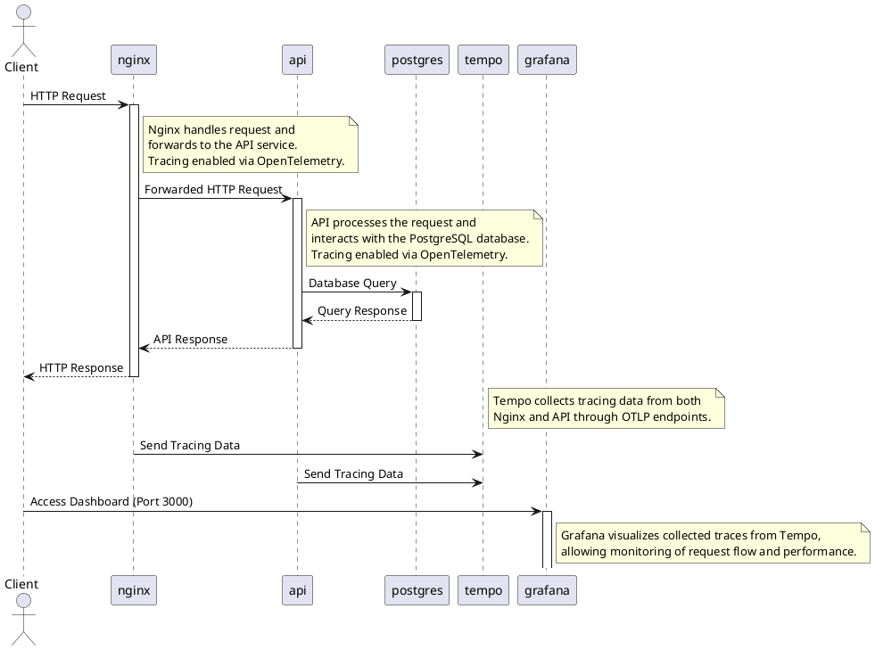

# Observability (Tracing and Monitoring)

This environment uses Docker Compose to set up a basic monitoring and tracing stack with `nginx`, `api`, `postgres`, `tempo`, and `grafana` services. It also includes OpenTelemetry tracing configuration.

## Prerequisites

- **Docker** and **Docker Compose** must be installed on your system.
- Clone or place this repository in your project directory for local volume mounting to work as expected.

## Components

### Networks
- **cloud**: A bridge network that allows all services to communicate with each other within the Docker network.

### Services

1. **nginx**
    - **Image**: `custom-nginx:latest`.
    - **Purpose**: Acts as the frontend proxy server and routes incoming requests.
    - **Tracing**: Configured to send traces to the `tempo` service with OpenTelemetry.
    - **Environment Variables**:
        - `OTEL_LOG_LEVEL`: Set to `debug` for detailed logging.
        - `OTEL_SERVICE_NAME`: Identifies this service as `nginx` in traces.
        - `OTEL_EXPORTER_OTLP_ENDPOINT`: Specifies the `tempo` endpoint to export traces over OTLP protocol.
    - **Depends On**: `tempo` and `api` services, ensuring they are started first.
    - **Ports**:
        - `80`: Exposes HTTP traffic on port 80.
    - **Volumes**:
        - Maps a custom Nginx configuration file located in `./docker/nginx/default.conf` to the container path `/etc/nginx/conf.d/default.conf`.

2. **api**
    - **Image**: `custom-api:latest`.
    - **Purpose**: A backend API service for processing requests and interacting with the database (`postgres`).
    - **Environment Variables**:
        - `APP_PORT`: Port on which the API listens (8080).
        - `APP_NAME`: Name of the application (api).
        - `TRACER_HOST`: `tempo` endpoint for OpenTelemetry traces.
        - `DB_URL`, `DB_USERNAME`, `DB_PASSWORD`: PostgreSQL database connection details.
    - **Depends On**: `tempo` and `postgres` to ensure these services are available before the API starts.
    - **Ports**:
        - `8080`: Exposes the API's HTTP port.

3. **postgres**
    - **Image**: `postgres:15`.
    - **Purpose**: A PostgreSQL database instance for persisting application data.
    - **Environment Variables**:
        - `POSTGRES_DB`: Database name (`postgres`).
        - `POSTGRES_USER` and `POSTGRES_PASSWORD`: Credentials for connecting to the database.
    - **Ports**:
        - `5432`: Exposes the database access on port 5432.
    - **Volumes**:
        - Stores PostgreSQL data in `./docker/postgres/data`, allowing data persistence between container restarts.

4. **tempo**
    - **Image**: `grafana/tempo:main-ce317a8`.
    - **Purpose**: Collects and stores trace data for distributed tracing, using OpenTelemetry protocols.
    - **Command Options**:
        - `-config.file=/etc/tempo.yaml`: Loads configuration from `./docker/tempo/tempo.yaml`.
        - `-config.expand-env=true`: Allows expansion of environment variables in the config.
    - **Ports**:
        - `4317`: Receives OTLP data over gRPC.
        - `4318`: Receives OTLP data over HTTP.
        - `3200`: Exposes the Tempo query frontend for trace retrieval.
    - **Volumes**:
        - Maps the configuration file (`tempo.yaml`) and data directory to `/etc/tempo.yaml` and `/var/tempo` for persistence and configuration.

5. **grafana**
    - **Image**: `grafana/grafana:11.2.2`.
    - **Purpose**: Provides a dashboard for visualizing and monitoring traces, metrics, and logs.
    - **Environment Variables**:
        - `GF_SECURITY_ADMIN_PASSWORD`: Sets the Grafana admin password.
    - **Depends On**: `tempo` to ensure traces can be queried from Tempo.
    - **Ports**:
        - `3000`: Exposes the Grafana web interface on port 3000.
    - **Volumes**:
        - Maps persistent Grafana data to `./docker/grafana/data` for data retention.

## Usage

1. **Start the environment**:
   ```bash
   sh ./docker/scripts/create.sh
   ```

2. **Access Services**:
    - **API**: [curl 'http://localhost/account/{id}'](curl 'http://localhost/account/{id}')
    - **Grafana**: [http://localhost:3000](http://localhost:3000) with `admin` as username and `123456` as password.

3. **Stop the environment**:
   ```bash
   sh ./docker/scripts/remove.sh
   ```

## Additional Notes

- **OpenTelemetry**: Traces from `nginx` and `api` are exported to `tempo`, enabling distributed tracing for requests.
- **Data Persistence**: PostgreSQL, Tempo, and Grafana data are persisted locally in respective directories under `./docker`.
- **Grafana Configuration**: Default admin credentials are `admin`/`123456`. Update the password in production for security.

## Happy Flow

Below information should give you a clear visualization of the request flow and where each component comes into play in this environment.


### Explanation

1. **Client** sends an HTTP request to **nginx**.
2. **Nginx** forwards the request to the **api** service.
3. The **api** service processes the request and interacts with the **postgres** database for data retrieval.
4. **Postgres** responds to the **api** service with the requested data.
5. **Api** responds back to **nginx** with the processed data.
6. **Nginx** returns the final HTTP response to the **Client**.
7. **Nginx** and **api** services send tracing data to **tempo** via OTLP endpoints.
8. **Client** can access **grafana** to view traces and monitor request flow.